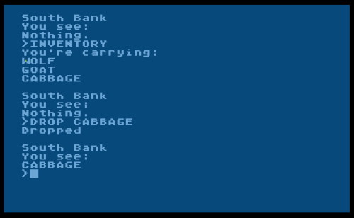

# 10line-2016-Cabbage
Cabbage text adventure game in Turbo BASIC XL for Atari 8-bit. Based on the Wolf, goat and cabbage problem. Entry for 2016 10-line BASIC contest

For my first entry in the NOMAM BASIC 10-Liners Contest for 2016, I wanted to see if I could do a text adventure game in just 10 lines of BASIC on the Atari 800. (I like Turbo Basic XL.) I went from that thought to finished game in just a few hours. Turns out it can be done — if you want a game with two rooms, three items, and five verbs. 

Wikipedia calls this the “fox, goose and bag of beans puzzle”. I first heard it as wolf, sheep, and cabbage, which wikipedia calls a “cosmetic variation.” (2020 update: Wikipedia now calls it the [Wolf, goat, and cabbage problem](https://en.wikipedia.org/wiki/Wolf,_goat_and_cabbage_problem)) I picked the latter for the game because a cabbage is funnier than a bag of beans, and easier to parse. I’m not sure why I changed it to goat, I goofed I guess. Though the single Chinese word yáng refers both to goats and sheep, so they’re interchangeable, sorta.

Full code description is at https://atariaction.tumblr.com/post/137586191122/cabbage
